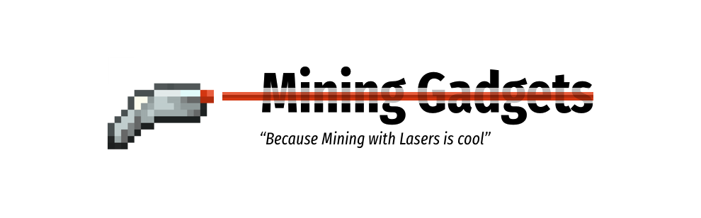

<h1 align="center" style="margin-top: 20px; border-bottom: 0;">Mining Gadgets</h1>

Sometimes you want a quick change of pace when it comes to mining. Pickaxes. Drills. Bores. Robots. Quarries. These are all great options. Now you can use lasers too if you want.

    
    

&zwnj;

# Mining Gadgets
*Because Mining with Lasers is cool*! Mining Gadgets is based on single gadget called the `Mining Gadget` which can be upgraded to do way more things than just mine. It can be upgraded to freeze water whilst mining, turn lava to stone whilst mining and loads more. It's core purpose is to be a balanced and effective way to mine large areas in short amounts of time whilst also, of course, shooting super cool __LASERS__!

## Features
- __LASERS__!
- On the fly, configurable, Mining Gadget for mining... Duh!
- Upgrades, lots of them...
- Modification table.
- 3x3 Mining area.
- FE/RF powered mining.
- Balanced (enough) mining
- Kept out the reach of young children... Seriously, it'll hurt!

## Getting hold of the mod!
You can check out our [CHANGELOG](CHANGELOG.md) to see what's been changing with the mod. You can get hold of the Mining Gadgets Mod on [Curse Forge](https://www.curseforge.com/minecraft/mc-mods/mining-gadgets) on our [Releases](https://github.com/Direwolf20-MC/MiningGadgets/releases) page on Github. Currently the mod support Minecraft `1.15.2` and `1.14.4` with plans to backport the mod to `1.12.2`. Please do not request backporting to older versions...

## How to:
### Charge the Gadget
To charge the gadget use the Charging Station from [Building Gadgets](https://www.curseforge.com/minecraft/mc-mods/building-gadgets) if you're playing in `1.14.4` otherwise, you'll need to go and grab a mod like RFTools to charge up the gadget. We're working on a new mod called `Charging Gadgets` for all your charging needs but it's not out just yet.. Sorry.

### Upgrade the Gadget
To upgrade the Gadget you'll need to craft a __Modification Table__ and which will accept your Mining Gadget on the left of the Gui which you can then __Shift Click__ the upgrades you have crafted (Found in JEI / Creative tab) into the Gadget. Once this is done, you should see your upgrade on the Gui at the top 👍 Good luck. Word of advice, the Power and 3x3 upgrades are great starter upgrades!

### Modify the power requirements
Check the config file in your `mcdir/config/` folder. You can change the upgrades 'Power per Operation' requirements as well as the Gadgets 'Power per Block Mined'.

---

*Whilst you're here, also check out my other mod [Building Gadgets](https://minecraft.curseforge.com/projects/building-gadgets) it goes really well with this one 😀*

## Credits
- [Direwolf20](https://github.com/Direwolf20-MC/) `Author, Primary Developer, Idea's man`
- [ErrorMikey](https://github.com/MichaelHillcox) `Developer, Gui King`
- [ItsTheBdoge](https://github.com/ItsTheBdoge) `3D Laser Model`
- [Soaryn](https://www.twitch.tv/soaryn) `Breaker of mods, Laser render help`
- [Rorax](https://twitter.com/Rosespikes) `Original Laser texture`
- [Forge Devs](https://minecraftforge.net) `CPW and Lex for making Forge the best API ever!!` [*support them*](https://www.patreon.com/LexManos)

## License 
[License MIT](LICENSE.txt)
